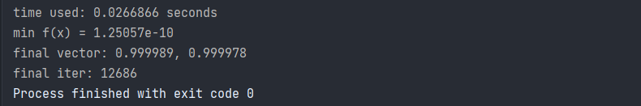

# 深蓝学院机器人数值优化课程作业

## 1. Rosenbrock function SGD optimization

### 1.1 参数及结果

**Parameters**:

* $\tau = 0.5$
* $\alpha=0.1$, step size
* precision = 1e-5

**Outcome**:



### 1.2 测试方法

有3个构造函数：

```cpp
    GradientDescentSolver(const Eigen::VectorXd &init_vec);
    GradientDescentSolver(std::vector<double> &init_vec);
    GradientDescentSolver(int n);
```

前两个不做介绍，最后一个n代表维度，可以处理$n>2$的数据。

在main.cpp中实例化对象即可，运算及输出函数已经写在构造函数中。

### 1.3 改进

起初step size给的很大，导致算法直接发散，这种情况出现的条件是：

* $f(x)<f(x+\tau d)$
* $x^*\in [x, x+\tau d]$

加了个判断，如果出现这种情况，虽然满足Armijo准则，但会朝着发散的方向更新，因此需要限制$x$的增量，具体做法如下：

```cpp
        // added by me
        if (RosenbrockFunc(m_init_vec) > RosenbrockFunc(m_init_vec - tau * direction)) {
            m_init_vec -= tau * direction;
        }
```

如果出现上述情况，$x$返回原值，而$\tau$继续更新（$\tau /= 2$），经过测试，原来step size = 0.1时直接发散，但此种情况不会发散。

另有继续取大步长，但迭代次数不会变少，是个疑问。
